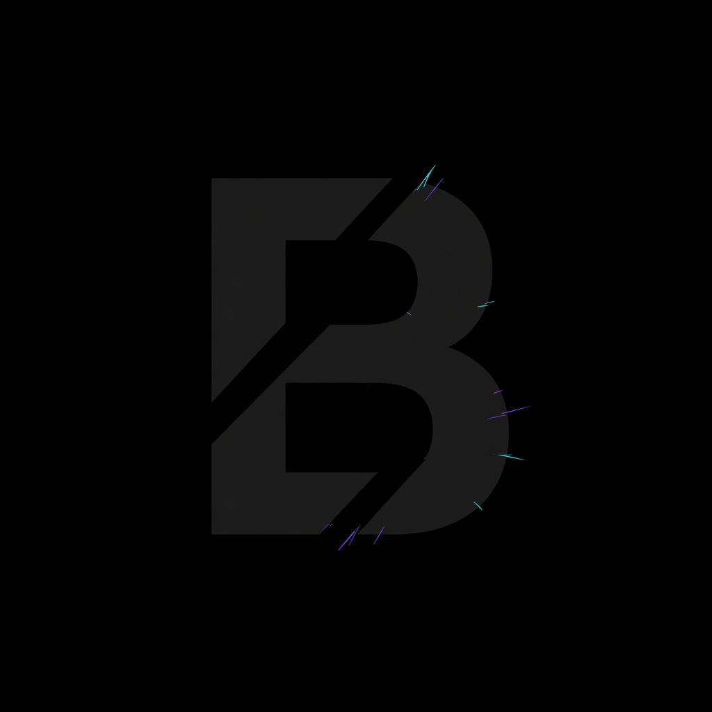
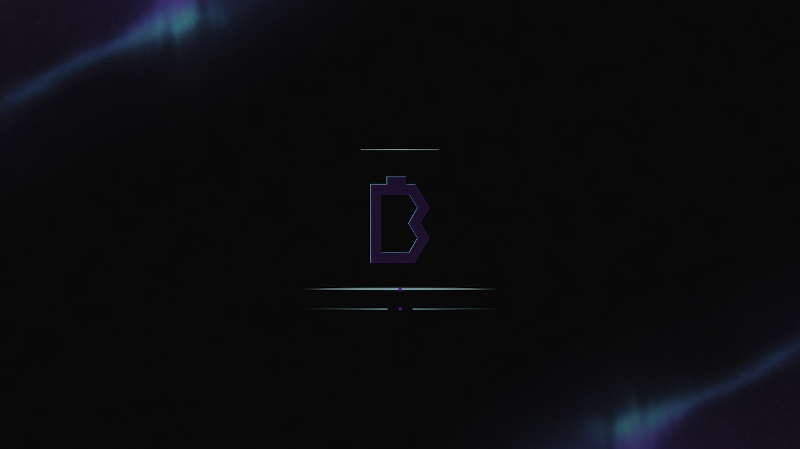
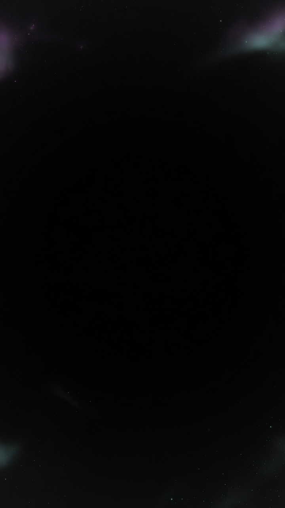

<p align="center">
  
</p>

<h1 align="center">BestROM</h1>

<p align="center">
  <strong>Pure AOSP Android 17</strong> · battery first · smooth by restraint · <code>peridot</code>
</p>

<p align="center">
  
</p>

<p align="center">
  <a href="https://github.com/Mohithash/bestrom_manifest/tree/17"></a>
  <a href="https://github.com/Mohithash/bestrom_manifest/tree/17"></a>
  <a href="https://sourceforge.net/projects/bestrom/"></a>
  
</p>

---

## What is BestROM?

**BestROM** is a **pure AOSP Android 17** custom ROM — not Lineage, not VoltageOS, not another heavy skin.

We are building toward one of the **first custom ROMs on Android 17** whose daily-driver promise is simple:

> **Best battery life + real smoothness — AOSP-compliant, without the cosmetic tax.**

| | |
|--|--|
| **Android** | 17 · API 37 · `android-17.0.0_r1` |
| **North star** | **Battery first** — then smoothness, then everything else |
| **Design** | **Aurora Night** — pure black `#000` + sparse violet/cyan |
| **First device** | Xiaomi **POCO F6 / Redmi Turbo 3** (`peridot`) |
| **Status** | Brand + scaffold live · device bring-up next |
| **Goal** | Clean AOSP daily driver — thrifty, fluid, honest |

> Tagline: **Android, refined. Battery first.**

---

## Design philosophy

### Battery is the most important feature

Modern Android often spends its budget on the wrong things: **cosmetic skins**, endless **animations**, heavy **artworks**, feature checklists, and **placebo “optimizations”** that look impressive in screenshots and feel worse in the pocket.

That cost is not free. It steals:

| What gets spent | What you lose |
|-----------------|---------------|
| GPU / compositor work on flashy UI | **Smoothness** and frame consistency |
| Always-on visual noise | **Fluidity** under real multitasking |
| Bright panels, skins, effects | **Battery juice** you needed by evening |
| Bloated “exclusive” features | Stability, updateability, AOSP clarity |

**BestROM rejects that trade.**

We believe a daily driver should feel **fast because it is light**, not because it papered over jank with motion blur and marketing. Battery is not a settings page we remember later — it is the **primary design constraint**. Every default, every surface, every optional extra has to answer:

1. Does this **help battery** (or at least not hurt it)?  
2. Does this keep the system **smooth and fluid** under real use?  
3. Is it still **AOSP-compliant** and maintainable — not a one-off skin fork?

If the answer is “it looks cool in a trailer,” it does not ship as a default.

### What we refuse

| We skip | Why |
|---------|-----|
| Heavy cosmetic skins | CPU/GPU and memory tax for brand theater |
| Animation for animation’s sake | Motion should clarify, not perform |
| Artwork walls & bright chrome | AMOLED pays in milliwatts; battery pays in hours |
| Feature bloat & placebo toggles | Complexity without real endurance or fluidity |
| “Everything maxed” defaults | 120 Hz + light UI + effects is the opposite of our product |

### What we build instead

| We ship | Why |
|---------|-----|
| **Pure AOSP 17 base** | Clean path, fewer surprise layers, real compliance |
| **Battery-first dark UI** | True black canvas on AMOLED; light is not the product |
| **Sparse craft** | Violet/cyan as *sparks*, not full-screen decoration |
| **Thrifty controls** | Charge limit, refresh sense, power-save that cuts *cost* |
| **Daily-driver honesty** | Radio, camera, stability over screenshot features |

**BestROM** = AOSP soul + product restraint.  
Not another ROM that pretends more chrome equals more quality.

### In one line

> *Less cosmetic tax. More battery. More smoothness. Still Android — pure AOSP 17.*

**Full philosophy:** [`docs/PHILOSOPHY.md`](docs/PHILOSOPHY.md)  
**UI / UX:** [`docs/BATTERY_UI.md`](docs/BATTERY_UI.md) · **Design system:** [`design/DESIGN_SYSTEM.md`](design/DESIGN_SYSTEM.md)  
**Branding kit:** [`brand/README.md`](brand/README.md)

---

## Visual language — dark for battery

Every default UI choice asks: *does this waste AMOLED power or compositor budget?*

| Law | Meaning |
|-----|---------|
| Pure black canvas | `#000000` primary backgrounds (pixels off) |
| Accents are sparks | Violet / cyan only on active states — not full-screen floods |
| Dark is the product | Not a half-supported light theme; battery leads the look |
| Controls match the look | Charge limit, refresh thrift, power-save that dims real cost |
| Motion stays cheap | Short, purposeful — not forever-on effects |

| Asset | Path |
|-------|------|
| **Philosophy** | [`docs/PHILOSOPHY.md`](docs/PHILOSOPHY.md) |
| Branding kit index | [`brand/README.md`](brand/README.md) |
| Design system | [`design/DESIGN_SYSTEM.md`](design/DESIGN_SYSTEM.md) |
| CSS tokens | [`design/tokens.css`](design/tokens.css) |
| Battery UI / UX | [`docs/BATTERY_UI.md`](docs/BATTERY_UI.md) |
| Feature roadmap | [`docs/FEATURES.md`](docs/FEATURES.md) |
| Complete ROM roadmap | [`docs/COMPLETE_ROM_ROADMAP.md`](docs/COMPLETE_ROM_ROADMAP.md) |
| Landing page | [`docs/index.html`](docs/index.html) |
| App icon | [`brand/logo/bestrom-icon.jpg`](brand/logo/bestrom-icon.jpg) |
| GitHub banner | [`brand/banner/github-banner.jpg`](brand/banner/github-banner.jpg) |
| AMOLED wallpaper | [`brand/wallpaper/bestrom-amoled.jpg`](brand/wallpaper/bestrom-amoled.jpg) |

**Palette:** black `#000000` · void `#0B0614` · violet `#7C3AED` · cyan `#22D3EE` · mist `#E2E8F0`

<p align="center">
  
</p>

---

## Architecture

```
AOSP android-17.0.0_r1
 ├── vendor/bestrom              ← brand, props, overlays (this project’s sister repo)
 ├── device/xiaomi/peridot @ 17   ← port from 16.2 (bring-up)
 ├── vendor/xiaomi/peridot @ 17
 └── kernel/xiaomi/sm8635* @ 17
         ↓
   BestROM for peridot
```

## Repositories

| Repo | Branch | Role |
|------|--------|------|
| **[bestrom-project](https://github.com/Mohithash/bestrom-project)** (this) | `main` | Hub · design · docs |
| [bestrom_manifest](https://github.com/Mohithash/bestrom_manifest) | `17` | Local manifests |
| [android_vendor_bestrom](https://github.com/Mohithash/android_vendor_bestrom) | `17` | `vendor/bestrom` |
| device / vendor / kernel forks | `17` | Bootstrap port |

## Build (when trees are ready)

```bash
mkdir ~/bestrom-a17 && cd ~/bestrom-a17

repo init -u https://android.googlesource.com/platform/manifest \
  -b android-17.0.0_r1 --git-lfs

mkdir -p .repo/local_manifests
curl -L -o .repo/local_manifests/bestrom.xml \
  https://raw.githubusercontent.com/Mohithash/bestrom_manifest/17/snippets/local_manifest_peridot.xml

repo sync -c -j$(nproc) --force-sync --no-clone-bundle

. build/envsetup.sh
source vendor/bestrom/build/envsetup.sh
bestrom_lunch peridot user
m -j$(nproc)
```

## Reality check

Peridot on **A17** is a **first-of-kind** effort. Trees on branch `17` start from working **16.2** sources and need HAL / sepolicy / kernel bring-up.

See [PORTING.md](https://github.com/Mohithash/bestrom_manifest/blob/17/PORTING.md).

## Downloads

[sourceforge.net/projects/bestrom](https://sourceforge.net/projects/bestrom/) · folder `peridot/` when builds ship.

## License

- BestROM original files: **Apache-2.0**
- AOSP / device / kernel: keep upstream licenses

---

<p align="center">
  <sub>BestROM · battery first · smooth by restraint · pure AOSP 17 · peridot first</sub>
</p>
