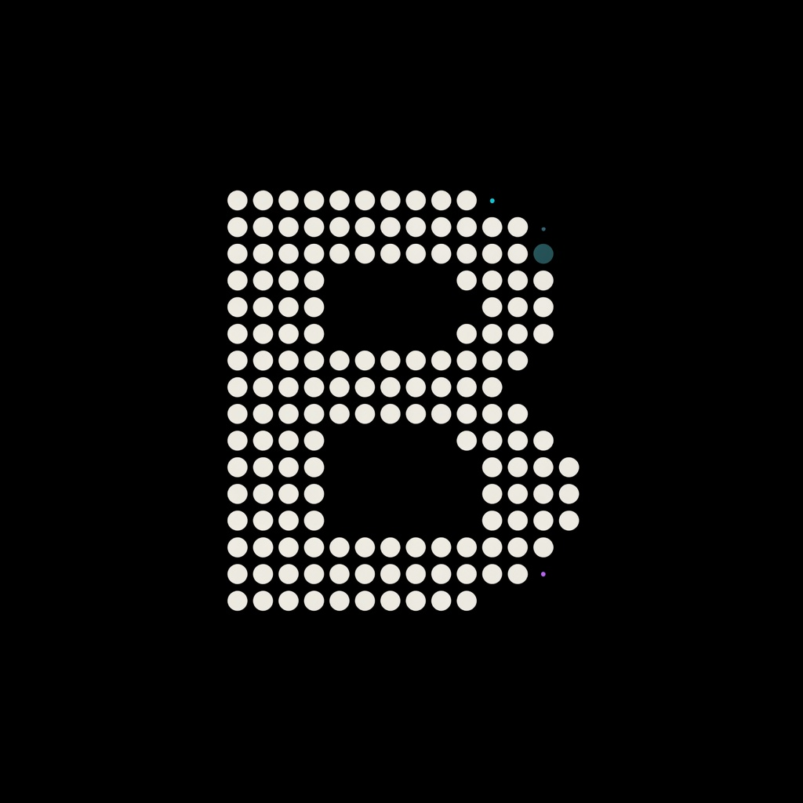
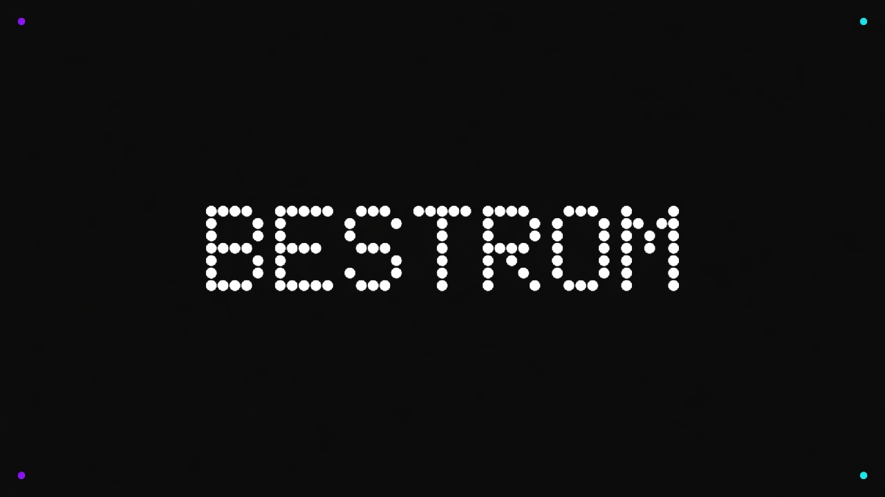
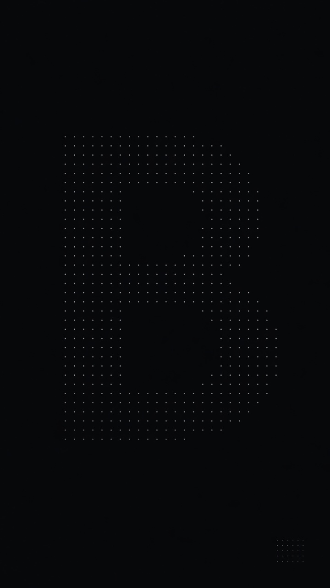

<p align="center">
  
</p>

<h1 align="center">BestROM</h1>

<p align="center">
  Pure AOSP 17 · battery-focused · black / grey UI · POCO F6 (<code>peridot</code>)
</p>

<p align="center">
  
</p>

<p align="center">
  <a href="https://github.com/Mohithash/manifest/tree/17"></a>
  <a href="https://github.com/Mohithash/manifest/tree/17"></a>
  <a href="https://sourceforge.net/projects/bestrom/"></a>
  
</p>

---

## What is BestROM?

Hobby **Android 17** ROM for the POCO F6. Priority is **battery** and a small,
dark UI — not skins or feature bloat.

BestROM is a product layer on top of [VoltageOS](https://github.com/VoltageOS)
6.1, which is itself built on LineageOS and AOSP. The forks under this account
carry the full upstream history, authors and notices; BestROM commits sit on
top of it.

| | |
|--|--|
| Android | 17 · AOSP via VoltageOS 6.1 |
| Focus | Battery · smooth daily use |
| UI | Black background · grey accents/dots only |
| Device | POCO F6 / Redmi Turbo 3 (`peridot`) first |
| Status | WIP — trees & brand public; A17 bring-up ongoing |

More: [About](docs/ABOUT.md) · [Philosophy](docs/PHILOSOPHY.md)

---

## Design philosophy

### Battery is the most important feature

Modern Android often spends its budget on the wrong things: **cosmetic skins**, endless **animations**, heavy **artworks**, feature checklists, and **placebo “optimizations”** that look impressive in screenshots and feel worse in the pocket.

That cost is not free. It steals:

| What gets spent | What you lose |
|-----------------|---------------|
| GPU / compositor work on flashy UI | **Smoothness** and frame consistency |
| Always-on visual noise | **Fluidity** under real multitasking |
| Bright panels, skins, effects | **Battery juice** you needed by evening |
| Bloated “exclusive” features | Stability, updateability, AOSP clarity |

**BestROM rejects that trade.**

We believe a daily driver should feel **fast because it is light**, not because it papered over jank with motion blur and marketing. Battery is not a settings page we remember later — it is the **primary design constraint**. Every default, every surface, every optional extra has to answer:

1. Does this **help battery** (or at least not hurt it)?  
2. Does this keep the system **smooth and fluid** under real use?  
3. Is it still **AOSP-compliant** and maintainable — not a one-off skin fork?

If the answer is “it looks cool in a trailer,” it does not ship as a default.

### What we refuse

| We skip | Why |
|---------|-----|
| Heavy cosmetic skins | CPU/GPU and memory tax for brand theater |
| Animation for animation’s sake | Motion should clarify, not perform |
| Artwork walls & bright chrome | AMOLED pays in milliwatts; battery pays in hours |
| Feature bloat & placebo toggles | Complexity without real endurance or fluidity |
| “Everything maxed” defaults | 120 Hz + light UI + effects is the opposite of our product |

### What we build instead

| We ship | Why |
|---------|-----|
| **Pure AOSP 17 base** | Clean path, fewer surprise layers, real compliance |
| **Black + grey only** | Brand colors forbidden except greys — Nothing-like quiet |
| **Grey dotted marks** | B / BESTROM as dots — thrifty on AMOLED |
| **Thrifty controls** | Charge limit, refresh sense, power-save that cuts *cost* |
| **Daily-driver honesty** | Radio, camera, stability over screenshot features |

**BestROM** = AOSP soul + **Nothing-like monochrome**.  

Same taste as **Nothing OS**: ultra minimal, empty space, **grey dotted letters**. Not a clone: **pure AOSP 17**, pure **black** canvas, **no brand hues** — only black and grey.

### In one line

> *Black. Grey dots. Ultra minimal. More battery. Still Android — pure AOSP 17.*

**About:** [`docs/ABOUT.md`](docs/ABOUT.md) · **Philosophy:** [`docs/PHILOSOPHY.md`](docs/PHILOSOPHY.md)  
**Press / social kit:** [`docs/PRESS_KIT.md`](docs/PRESS_KIT.md) · **Bios:** [`docs/SOCIAL_BIOS.md`](docs/SOCIAL_BIOS.md)  
**Dot type:** [`design/DOT_TYPE.md`](design/DOT_TYPE.md) · **Branding:** [`brand/README.md`](brand/README.md)  
**UI / UX:** [`docs/BATTERY_UI.md`](docs/BATTERY_UI.md) · **Design system:** [`design/DESIGN_SYSTEM.md`](design/DESIGN_SYSTEM.md)

---

## Visual language — black + grey dots only

**Hard palette law:** brand design may use **only black and greys**. No violet, cyan, or other hues.

| Law | Meaning |
|-----|---------|
| Pure black canvas | `#000000` backgrounds — **always** |
| Grey dots only | Logo / wordmark = mid greys `#9CA3AF` / `#D1D5DB` on black |
| Ultra minimal | Empty space > decoration (Nothing-like quiet) |
| No brand rainbow | Zero violet/cyan/neon in BestROM chrome |
| No light product skin | Dark-only from Setup → home → Settings → QS |
| Motion stays cheap | Short grey-dot assemble — no color cycles |

| Asset | Path |
|-------|------|
| **About (project)** | [`docs/ABOUT.md`](docs/ABOUT.md) |
| **Press kit (PR / social)** | [`docs/PRESS_KIT.md`](docs/PRESS_KIT.md) |
| **Social bios** | [`docs/SOCIAL_BIOS.md`](docs/SOCIAL_BIOS.md) |
| **Philosophy** | [`docs/PHILOSOPHY.md`](docs/PHILOSOPHY.md) |
| Branding kit index | [`brand/README.md`](brand/README.md) |
| Design system | [`design/DESIGN_SYSTEM.md`](design/DESIGN_SYSTEM.md) |
| Dot type (logo letters) | [`design/DOT_TYPE.md`](design/DOT_TYPE.md) |
| CSS tokens | [`design/tokens.css`](design/tokens.css) |
| Battery UI / UX | [`docs/BATTERY_UI.md`](docs/BATTERY_UI.md) |
| Feature roadmap | [`docs/FEATURES.md`](docs/FEATURES.md) |
| Complete ROM roadmap | [`docs/COMPLETE_ROM_ROADMAP.md`](docs/COMPLETE_ROM_ROADMAP.md) |
| Landing page | [`docs/index.html`](docs/index.html) |
| App icon | [`brand/logo/bestrom-icon.jpg`](brand/logo/bestrom-icon.jpg) |
| GitHub banner | [`brand/banner/github-banner.jpg`](brand/banner/github-banner.jpg) |
| AMOLED wallpaper | [`brand/wallpaper/bestrom-amoled.jpg`](brand/wallpaper/bestrom-amoled.jpg) |

**Palette:** black `#000000` · grey dots `#6B7280` / `#9CA3AF` / `#D1D5DB` — **that is all**

<p align="center">
  
</p>

---

## Architecture

```
AOSP android-17.0.0_r1
 └── VoltageOS 6.1              ← base product config, apps and overlays
      ├── vendor/bestrom              ← brand, props, overlays (this project’s sister repo)
      ├── device/xiaomi/peridot @ 17   ← port from 16.2 (bring-up)
      ├── vendor/xiaomi/peridot @ 17
      └── kernel/xiaomi/sm8635* @ 17
                ↓
          BestROM for peridot
```

## Repositories

| Repo | Branch | Role |
|------|--------|------|
| **[bestrom-project](https://github.com/Mohithash/bestrom-project)** (this) | `main` | Hub · design · docs |
| [manifest](https://github.com/Mohithash/manifest) | `17` | `repo init` entry point: VoltageOS 17 plus the BestROM snippet |
| [vendor_bestrom](https://github.com/Mohithash/vendor_bestrom) | `17` | `vendor/bestrom`: branding, overlays, `tools/mcp` |
| [device_xiaomi_peridot](https://github.com/Mohithash/device_xiaomi_peridot) | `17` | POCO F6 device tree |
| [vendor_xiaomi_peridot](https://github.com/Mohithash/vendor_xiaomi_peridot) | `17` | Proprietary blobs |
| [kernel_xiaomi_sm8635](https://github.com/Mohithash/kernel_xiaomi_sm8635) | `17` | Theettam kernel |
| [frameworks_base](https://github.com/Mohithash/frameworks_base), [packages_apps_Settings](https://github.com/Mohithash/packages_apps_Settings), [packages_apps_Freezer](https://github.com/Mohithash/packages_apps_Freezer) and the other `Mohithash/<path_with_underscores>` forks | `17` | BestROM changes on top of VoltageOS |
| [bestrom_ota](https://github.com/Mohithash/bestrom_ota) | `17` | OTA catalog read by the Updater |

## Build

One manifest, one branch. Needs the usual AOSP build host (Ubuntu, `repo`, ~400 GB free).

```bash
mkdir ~/bestrom && cd ~/bestrom
repo init -u https://github.com/Mohithash/manifest -b 17 --git-lfs
repo sync -c -j$(nproc) --no-clone-bundle

. build/envsetup.sh
lunch bestrom_peridot-cp2a-user
mka bestrom
```

The zip lands in `out/target/product/peridot/`. The tree also ships
`AGENTS.md` and `.mcp.json` at its root, so an AI agent (Claude Code, Cursor,
Codex) can sync, build, verify and test it through the BestROM MCP server in
`vendor/bestrom/tools/mcp`.

## Status

Peridot on Android 17 ships as official builds; see the release notes on
SourceForge for what changed in each one.

## Downloads

[sourceforge.net/projects/bestrom](https://sourceforge.net/projects/bestrom/) · folder `peridot/`. The Updater app checks for new builds itself.

## Community & visibility

| | |
|--|--|
| **Issues** | Use GitHub Issues (templates in [`.github/`](.github/)) |
| **Contributing** | [`.github/CONTRIBUTING.md`](.github/CONTRIBUTING.md) |
| **Security** | [`.github/SECURITY.md`](.github/SECURITY.md) |
| **Press kit** | [`docs/PRESS_KIT.md`](docs/PRESS_KIT.md) — Reddit, X, XDA, Telegram copy |
| **Share** | Always link this hub + monochrome logo/banner |

**Topics:** `android` · `aosp` · `android-17` · `custom-rom` · `bestrom` · `peridot` · `poco-f6` · `battery`

## License

- BestROM original files: **Apache-2.0**
- AOSP / device / kernel: keep upstream licenses

---

<p align="center">
  <sub>BestROM · black · grey dots · pure AOSP 17 · peridot first</sub>
</p>
